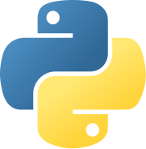
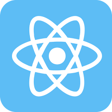
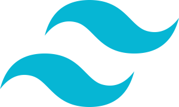

### Hello, my name is Oleg.

## I'm a Son, Brother, Developer and Student!

- 🌱 I’m currently learning everything related to web-development
- 👀 I’m interested in creating full-stack apps
- 📫 How to reach me: Page on [Fiverr](https://www.fiverr.com/dbofury), profile on [UpWork](https://www.upwork.com/freelancers/~01bc2c6d8b19205903), prifile on [LinkedIn](https://www.linkedin.com/in/%D0%BE%D0%BB%D0%B5%D0%B3-%D0%B4%D0%B8%D0%B4%D0%B5%D1%87%D0%BA%D0%B8%D0%BD-881687214/?locale=en_US), gmail: oleg.didechkin@gmail.com

### Languages and Tools:

